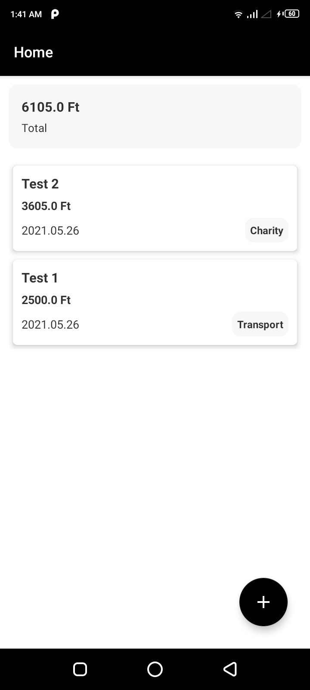
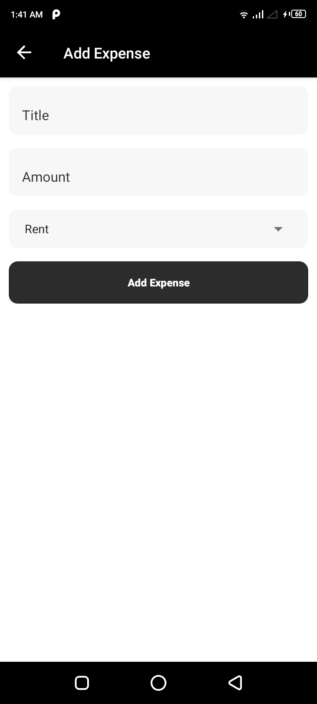

<h3>Expense Tracker App</h3>
<h4>Built using Kotlin.</h4>
<h4>Components used</h4>
<ul>
   <li> MVVM Architecture </li>
   <li> Hilt </li>
   <li> Navigation Components </li>
   <li> Coroutines </li>
   <li> LiveData, ViewModel </li>
   <li> Room Database </li>
</ul>

<h4>Download the source code and extract zip file. Open Android Studio and select option "Open an Existing Project". Now locate downloaded folder. </h4>

<h4>You can also download APK file in Android device and install it to check app. <a href="https://drive.google.com/file/d/1x0mMrGT2-R1IOSDdJ5daXPxjXVGCKHNa/view?usp=sharing"> Click here to download. </a> </h4>

<h4>Screenshots</h4>

<table>
  <tr>
    <td>  </td>
    <td>  </td>
  </tr>
</table>
